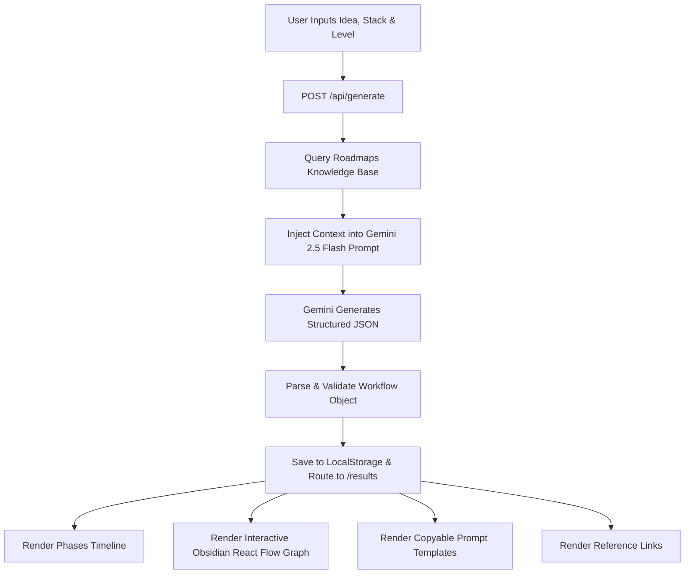

# ⚡ DevFlow AI

> **Intelligent AI-Powered Developer Workflow & Architecture Advisor**

DevFlow AI transforms raw project ideas into structured, phased engineering plans, curated tool ecosystems, and production-ready prompt templates in seconds. Built on **Next.js 16 (App Router)**, **React 19**, **Google Gemini 2.5 Flash**, and **@xyflow/react**.

---

## 🌟 Overview

Navigating the exploding landscape of AI developer tools, frameworks, and deployment platforms is overwhelming. Developers and hackathon teams often lose hours researching tools and crafting prompts rather than writing code.

**DevFlow AI solves this by acting as an autonomous technical architect:**
1. **Phased Execution Roadmaps:** Breaks your project into structured milestones with clear time estimates and actionable tasks.
2. **Curated Tool Stack:** Matches your exact project domain with the best free and paid tools across UI/UX, frontend, backend, database, and AI integrations.
3. **Obsidian-Style Interactive Graph:** Visualizes your tool ecosystem and development hierarchy as an interactive node graph powered by `@xyflow/react`.
4. **Feedough-Engineered Prompts:** Generates copy-pasteable, role-tailored prompt templates (Persona, Context, Task, Constraints) for Cursor, Claude, ChatGPT, v0, and Bolt.
5. **Integrated Knowledge Roadmaps:** Leverages a built-in knowledge base of developer role and skill roadmaps to contextualize AI recommendations.

---

## 🚀 Key Features

### 🧠 1. AI Workflow Engine (`/generate` & `/api/generate`)
- **Input Parameters:** Project idea description, target stack domains (Frontend, Backend, AI Integration, Deployment, 3D Design, Database), and developer experience level (`beginner`, `intermediate`, `expert`).
- **Context-Augmented Generation:** Dynamically queries built-in role/skill roadmaps (`@/data/roadmaps`) using keyword heuristics and injects relevant learning modules into the LLM prompt.
- **Model:** Powered by Google's `gemini-2.5-flash` model for low latency and high accuracy structured JSON output.

### 📊 2. Interactive Results Dashboard (`/results`)
- **Phases Tab:** Step-by-step timeline of development phases, durations, and prioritized deliverables.
- **Tools Tab (Dual-View):**
  - **Blocks View:** Categorized card layout with pricing badges (Free / Paid / Free Tier) and direct links.
  - **Obsidian Graph View:** Interactive canvas displaying the project hub, category clusters (Code Generation, UI/UX, Research & Debugging), and dynamically mapped tool nodes with custom colors, glowing halos, and pan/zoom controls.
- **Prompts Tab:** Production-ready prompt templates with one-click copy to clipboard.
- **References Tab:** Curated documentation, official guides, and reference resources tailored to the project.

### 📚 3. Resources Hub (`/resources`)
A categorized catalog of essential developer tools:
- **🎨 UI / UX Design:** Figma AI, Galileo AI, Uizard, Framer AI
- **⚡ Figma → Frontend Code:** Builder.io Visual Copilot, Anima, Locofy.ai, DhiWise
- **🤖 Backend & AI Coding:** Claude, GitHub Copilot, Cursor, Codeium
- **🗄️ Database & Cloud Infrastructure:** Supabase, Neon, PlanetScale, Railway
- **🧠 AI & ML Integration:** Google AI Studio (Gemini), Hugging Face, Replicate, LangChain

### 🗺️ 4. Structured Developer Roadmaps (`/roadmaps` & `/roadmaps/[slug]`)
- Comprehensive guides covering **Role-Based Roadmaps** (Frontend, Backend, Full Stack, DevOps, AI Engineer, React), **Skill-Based Roadmaps**, and **Best Practices**.
- Built-in one-click action to generate a customized AI learning workflow based on any roadmap topic.

### 🎨 5. Cyberpunk & Obsidian Design System
- Pitch-black obsidian theme (`#000000`) with high-contrast electric lime accents (`#D4FF3F`) and lavender badges (`#B692FE`).
- Custom trailing cursor physics and viewport scroll-reveal animations via `AnimationProvider`.
- Glassmorphism cards (`card-glass`), custom typography, and responsive layouts.

---

## 🏗️ Architecture & Project Structure

```
devflow-ai/
├── app/
│   ├── api/
│   │   └── generate/
│   │       └── route.ts          # AI workflow generation endpoint (Gemini API)
│   ├── generate/
│   │   └── page.tsx              # Project idea & stack input form
│   ├── resources/
│   │   └── page.tsx              # Curated developer tools & roadmaps showcase
│   ├── results/
│   │   └── page.tsx              # Workflow dashboard & React Flow graph
│   ├── roadmaps/
│   │   ├── [slug]/
│   │   │   └── page.tsx          # Dynamic roadmap detail & prompt pre-filler
│   │   └── page.tsx              # Roadmaps directory page
│   ├── globals.css               # Design system tokens, utilities & animations
│   ├── layout.tsx                # Root layout with AnimationProvider & metadata
│   └── page.tsx                  # Landing page with hero, marquee & CTA
├── components/
│   ├── ui/
│   │   └── button.tsx            # Reusable button component (CVA + Radix)
│   └── AnimationProvider.tsx     # Custom cursor & scroll reveal observer
├── data/
│   └── roadmaps/
│       ├── best-practices.ts     # Best practice guides data
│       ├── helpers.ts            # Roadmap search & query filtering algorithms
│       ├── index.ts              # Central roadmap exports
│       ├── role-roadmaps.ts      # Role-based roadmap definitions
│       ├── skill-roadmaps.ts     # Skill-based roadmap definitions
│       └── types.ts              # TypeScript interfaces for roadmaps
├── lib/
│   ├── ai.ts                     # Google Generative AI client initialization
│   ├── supabase.ts               # Supabase browser/server client setup
│   └── utils.ts                  # Tailwind class merging utility (clsx + twMerge)
├── types/
│   └── index.ts                  # Workflow, Tool, Prompt, and Phase interfaces
├── .env.local                    # Environment configuration
├── next.config.ts                # Next.js configuration
├── package.json                  # Dependencies & npm scripts
└── tsconfig.json                 # TypeScript compiler configuration
```

---

## 🛠️ Tech Stack

| Domain | Technology | Description |
| :--- | :--- | :--- |
| **Framework** | [Next.js 16 (App Router)](https://nextjs.org/) | Server Components, Client Components, API Routes |
| **UI Library** | [React 19](https://react.dev/) | Modern concurrent UI engine |
| **Language** | [TypeScript 5](https://www.typescriptlang.org/) | End-to-end type safety |
| **Styling** | [Tailwind CSS v4](https://tailwindcss.com/) | Modern utility-first styling with custom CSS variables |
| **AI SDK** | [@google/generative-ai](https://www.npmjs.com/package/@google/generative-ai) | Google Gemini 2.5 Flash API integration |
| **Node Graph** | [@xyflow/react](https://reactflow.dev/) | Interactive obsidian-style node graph visualization |
| **Backend & DB** | [@supabase/supabase-js](https://supabase.com/) | Supabase client for database & auth capabilities |
| **Icons & UI** | [Lucide React](https://lucide.dev/) & [Radix UI](https://www.radix-ui.com/) | Accessible icons and headless primitives |

---

## ⚡ Getting Started

### Prerequisites
- **Node.js**: `v20.x` or higher
- **Package Manager**: `npm`, `pnpm`, `yarn`, or `bun`
- **Gemini API Key**: Obtain a free API key from [Google AI Studio](https://aistudio.google.com/)
- **Supabase Account (Optional)**: Obtain credentials from [Supabase](https://supabase.com/)

### 1. Clone the Repository
```bash
git clone https://github.com/SaiNandhan06/DevFlowAI.git
cd devflow-ai
```

### 2. Install Dependencies
```bash
npm install
# or
pnpm install
# or
yarn install
```

### 3. Configure Environment Variables
Create a `.env.local` file in the root of the `devflow-ai` directory:

```env
# Google Gemini API Key (Required for AI Workflow Generation)
GEMINI_API_KEY=your_gemini_api_key_here

# Supabase Credentials (Optional / Backend Storage)
NEXT_PUBLIC_SUPABASE_URL=https://your-project.supabase.co
NEXT_PUBLIC_SUPABASE_ANON_KEY=your_supabase_anon_key_here
```

### 4. Run the Development Server
```bash
npm run dev
```

Visit [http://localhost:3000](http://localhost:3000) in your browser to start exploring and generating workflows.

---

## ⚙️ Available Scripts

| Command | Description |
| :--- | :--- |
| `npm run dev` | Starts the development server at `localhost:3000` with hot reloading |
| `npm run build` | Compiles and optimizes the Next.js application for production |
| `npm run start` | Runs the compiled production build |
| `npm run lint` | Runs ESLint to check for code quality and syntax issues |

---

## 🔄 How It Works (Workflow Lifecycle)



1. **User Submission:** The user fills in their idea, chooses applicable stack domains, and selects their experience level on `/generate`.
2. **Context Enrichment:** The backend queries `data/roadmaps/helpers.ts` for relevant roadmap paths based on the submitted stack and idea keywords.
3. **Structured Generation:** The prompt directs Gemini to act as a senior technical advisor and expert prompt generator, enforcing strict JSON schema compliance.
4. **Interactive Visualization:** The output is visualized on `/results` across structured tabs, with tools mapped into both an Obsidian graph and a card grid.

---

## 👤 Author

- **M Sainandhan**  
  - LinkedIn: [linkedin.com/in/sainandhan](https://www.linkedin.com/in/sainandhan/)
  - GitHub: [@SaiNandhan06](https://github.com/SaiNandhan06)

---

## 📄 License

This project is licensed under the MIT License — see the repository for details.
